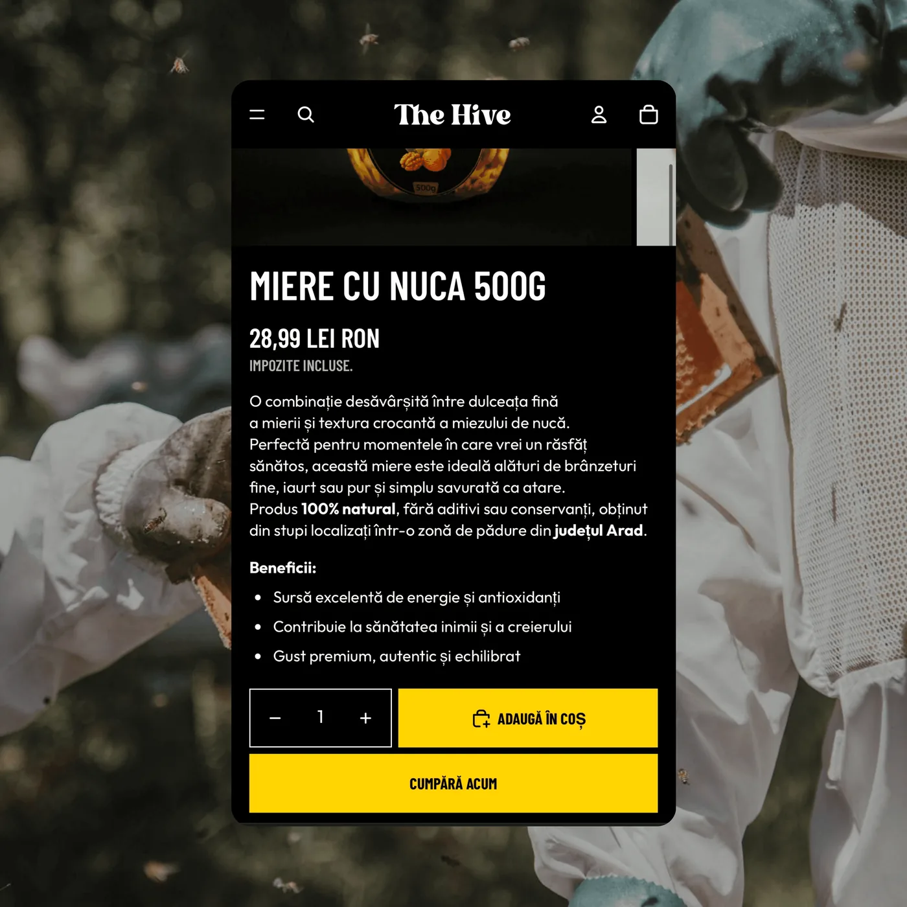

# Ecomlab — site de prezentare

Site static (HTML + CSS + JS, fără build tools). Deschide `index.html` sau găzduiește folderul pe Netlify / Vercel / GitHub Pages / orice hosting static.

## Structură

```
index.html        — pagina completă (toate secțiunile)
css/fonts.css     — fonturi self-hosted (Cal Sans + Hanken Grotesk)
css/style.css     — design system + stiluri
js/main.js        — interacțiuni (reveal, marquee, slider, formular)
assets/           — imagini, logo-uri, video, fonturi
```

## Cum adaugi clipurile la Proiecte

Fiecare proiect din secțiunea „Proiecte recente” e un `<figure class="project">`.
Pune fișierul clipului în `assets/clips/` și adaugă atributul `data-video`:

```html
<figure class="project" data-video="assets/clips/thehive.mp4">
  
</figure>
```

Clipul pornește automat (mut, în buclă) când intră în viewport; imaginea existentă devine poster.

## Formular de contact

Trimite emailuri către **office.ecomlab@gmail.com** prin [FormSubmit](https://formsubmit.co) (gratuit, fără cont).

> **Important:** la prima trimitere, FormSubmit trimite un email de activare către
> office.ecomlab@gmail.com — dă click pe linkul din el o singură dată, apoi formularul
> livrează mesajele normal.

## Butonul „Programează o întâlnire”

Deschide WhatsApp la +40 728 541 017 cu mesaj precompletat. Îl poți schimba editând
linkurile `https://wa.me/40728541017?text=...` din `index.html`.

## De completat ulterior

- Linkurile sociale din footer (LinkedIn / Instagram / TikTok) sunt `#` momentan.
- Paginile „Politica Confidentialitate” și „Termeni si Conditii” sunt `#` momentan.
- Testimonialele 2 și 3 (The Hive, Piky) sunt placeholder — înlocuiește-le cu citate reale
  (caută `PLACEHOLDER` în `index.html`).
